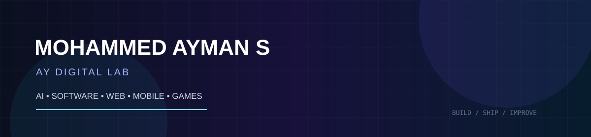

<div align="center">



### SOFTWARE DEVELOPER · AI/ML · FULL-STACK · GAME DEVELOPMENT

**BUILD · INNOVATE · IMPACT**

</div>

---

## `01` — ABOUT ME

I'm Mohammed Ayman S, a developer focused on building practical software products, AI-powered applications, web experiences, Android apps, and games.

I enjoy taking an idea from **concept → development → testing → release**.

```text
FOCUS
├── AI / Machine Learning
├── Full-Stack Web Development
├── Android Development
├── Game Development with Godot
└── Developer Tools & Digital Products
```

---

## `02` — WHAT I BUILD

| AREA | FOCUS |
|---|---|
| 🧠 AI / ML | AI-powered applications, automation and intelligent tools |
| `</>` Web | Full-stack applications and modern web experiences |
| 📱 Mobile | Android applications and mobile-first interfaces |
| 🎮 Games | Interactive experiences and game development |
| 🛠 Tools | Calculators, utilities and developer-focused products |

---

## `03` — FEATURED WORK

### 🛡️ [CyberShield](https://github.com/MohammedAyman07/CyberShield)
Cybersecurity scanning and analysis project.

**Focus:** Python · security concepts · analysis tools

### 🎨 [AI Imagine App](https://github.com/MohammedAyman07/AI-IMAGINE-APP)
Android application project focused on AI-powered image experiences.

**Focus:** Android · application development · AI integration

### 🧮 [AY All-in-One Calculator — Web](https://github.com/MohammedAyman07/AY-ALL-IN-ONE-CALCULATORWEBSITE-)
Web-based all-in-one calculator project.

**Focus:** JavaScript · UI/UX · calculation logic · responsive web

### 📱 [AY All-in-One Calculator — Android](https://github.com/MohammedAyman07/AY-ALL-IN-ONE-CALCULATOR-APP)
Android calculator application project.

**Focus:** Android · mobile UI · calculation logic

### 🎮 [Choose Game for Students](https://github.com/MohammedAyman07/choose-game-for-students)
Interactive student-focused game project.

**Focus:** game logic · interaction · web development

### 🛍️ [Shopify Theme](https://github.com/MohammedAyman07/shopifytheme)
Custom Shopify theme development project.

**Focus:** Shopify · Liquid · storefront UI · responsive design

---

## `04` — TECH STACK

**Languages**

`Python` `JavaScript` `HTML` `CSS` `SQL` `GDScript`

**Development**

`React` `Node.js` `Android` `Godot` `Git` `GitHub`

**AI / ML**

`AI APIs` `Machine Learning` `Automation` `Computer Vision`

---

## `05` — CURRENTLY BUILDING

```text
● BOUNZO
  Mobile game development and release preparation

● AI / SOFTWARE PROJECTS
  Building practical applications and developer tools

● WEB & DIGITAL PRODUCTS
  Modern websites, utilities and digital products

● ANDROID APPLICATIONS
  Mobile productivity and utility apps
```

---

## `06` — DEVELOPMENT PRINCIPLES

```text
01  Build something useful
02  Keep the code understandable
03  Test before release
04  Fix the root cause, not only the symptom
05  Keep improving
```

> **Code is not just what I write. It's how I solve problems.**

---

## `07` — LET'S CONNECT

<div align="center">

[](https://github.com/MohammedAyman07)

**MOHAMMED AYMAN S · AY DIGITAL LAB**

</div>
